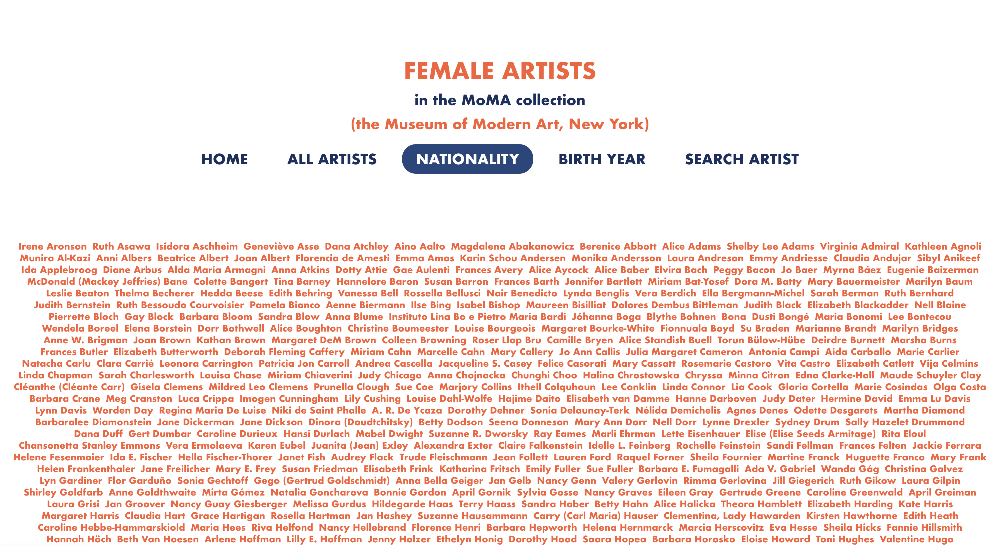

# Female Artists in Moma Collection

A React project showcasing and fetching all data from my express API project. Originally created with JavaScript, now migrated to TypeScript.

## Functionality

The user can:

- See all female artists in the datset
- Search for artists based on nationality
- Select artist bsaed on year they were born after
- Search all artists in the dataset
- Click on an artist to see more details

## Technology and tools

- React
- Typescript
- Styled components
- React Router
- Postman
- Express.js
- REST API

## Backend repository

https://github.com/Vera-Sjunnesson/project-express-api

## View it live

- Frontend: https://female-artists-express-api.netlify.app/
- Backend: https://project-express-api-qsyn7wqw7a-lz.a.run.app/

